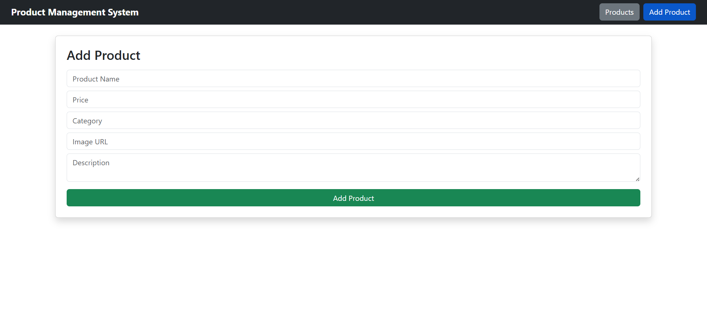
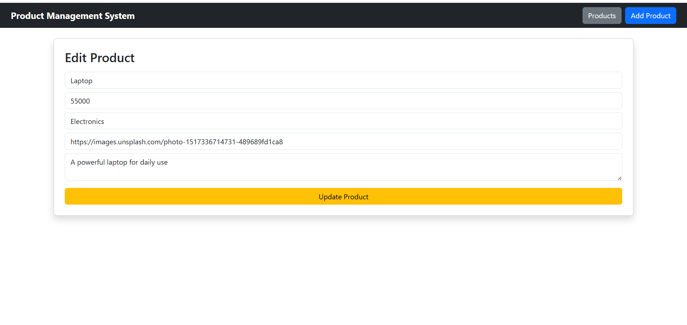
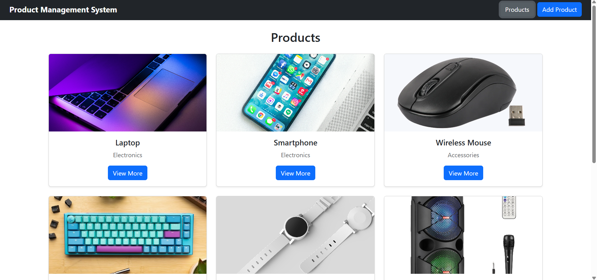
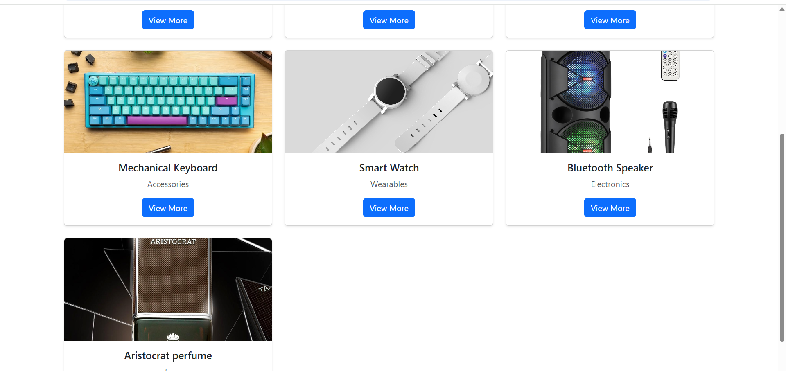
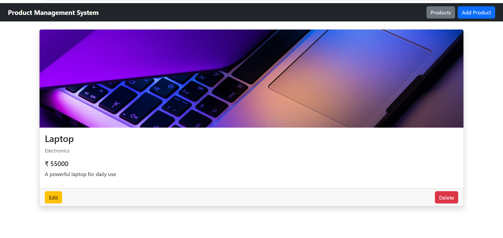

# Product Management System (MERN)

##  Features
- Create, Read, Update, Delete products
- REST API integration
- Frontend built with React
- Backend using Node.js & Express
- MongoDB database

##  Tech Stack
MongoDB | Express.js | React.js | Node.js

##  Screenshots

### ➤ Add Product

### ➤ Edit Product

### ➤ Product List

### ➤ Product List (View 2)

### ➤ View Single Product

##  Setup
1. Clone repo
2. Run backend: npm install → npm start
3. Run frontend: npm install → npm start
